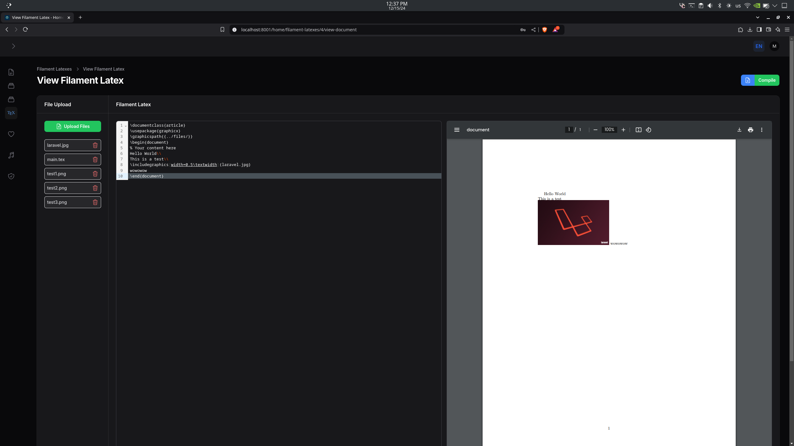
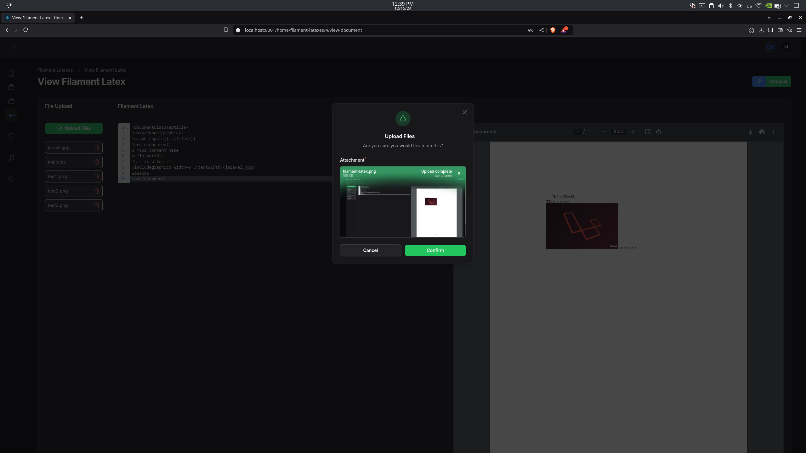

# Filament LaTeX

[](https://packagist.org/packages/thethunderturner/filament-latex)
[](https://github.com/thethunderturner/filament-latex/actions?query=workflow%3Arun-tests+branch%3Amain)
[](https://github.com/thethunderturner/filament-latex/actions?query=workflow%3A"Fix+PHP+code+styling"+branch%3Amain)
[](https://packagist.org/packages/thethunderturner/filament-latex)

Filament LaTeX is a powerful package that allows you to generate PDFs from LaTeX templates. The plugin is still in development, but the basic functionality is implemented.
<div style="display: flex; align-items: center; justify-content: center;">
    
    
</div>

## Installation

Before you start, make sure you have `texlive-full` or `texlive-base` installed on your system. You can install it on an Unix based system (Linux/MacOS) by running:
```bash
sudo apt-get install texlive-full # for debian based systems
sudo pacman -S texlive-full # for arch based systems
brew install texlive-full # for MacOS
```
If you are on Windows then please visit the [TeX Live website](https://tug.org/texlive/windows.html) and follow the instructions. \
After you have installed `texlive`, find where the `pdflatex` binary is located by running this in your console:
```bash
which pdflatex # for Unix based systems
where pdflatex # for Windows
```
Copy and paste the path on the plugin configuration file. <br>
You can install the package via composer:
```bash
composer require thethunderturner/filament-latex
```

You can publish and run the migrations with:

```bash
php artisan vendor:publish --tag="filament-latex-migrations"
php artisan migrate
```

You can publish the config file with:

```bash
php artisan vendor:publish --tag="filament-latex-config"
```
After publishing the path, make sure you replace the path of your `pdflatex` binary in the `config/filament-latex.php` file. \
\
Optionally, you can publish the views using

```bash
php artisan vendor:publish --tag="filament-latex-views"
```

You can use the package by adding it to the plugins list of your panel.
```php
->plugins([
    // ...
    FilamentLatexPlugin::make(),
]);
```

## Changelog

Please see [CHANGELOG](CHANGELOG.md) for more information on what has changed recently.

## Contributing

Please see [CONTRIBUTING](.github/CONTRIBUTING.md) for details.

## Security Vulnerabilities

Please review [our security policy](../../security/policy) on how to report security vulnerabilities.

## Credits

- [Matthaios Biskas](https://github.com/thethunderturner)
- [All Contributors](../../contributors)

## License

The MIT License (MIT). Please see [License File](LICENSE.md) for more information.
